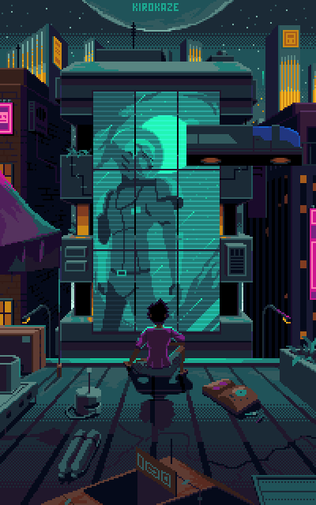

<table>
    <tr>
        <td style="width: 50%;">
            </img>
        </td>
        <td style="width: 50%; vertical-align: top;">
        

        ░█░░░█░█░█▀▀░█▀█░█▀▀░░░█▀▀░█░█░█▀█░█░█░█▀▀░█▀▀
        ░█░░░█░█░█░░░█▀█░▀▀█░░░█░░░█▀█░█▀█░▀▄▀░█▀▀░▀▀█
        ░▀▀▀░▀▀▀░▀▀▀░▀░▀░▀▀▀░░░▀▀▀░▀░▀░▀░▀░░▀░░▀▀▀░▀▀▀

        /𝙰𝙱𝙾𝚄𝚃_𝙼𝙴  
        │
        ├── /𝙱𝙸𝙾
        │    ├── 𝙰𝚗𝚢 𝚙𝚛𝚘𝚗𝚘𝚞𝚗𝚜 - 𝙱𝚛𝚊𝚣𝚒𝚕𝚒𝚊𝚗 - 𝙿𝚃-𝙱𝚁 + 𝙴𝚗𝚐𝚕𝚒𝚜𝚑
        │    ├── 𝙴𝚖𝚋𝚎𝚍𝚍𝚎𝚍 𝚂𝚢𝚜𝚝𝚎𝚖𝚜 𝙳𝚎𝚟𝚎𝚕𝚘𝚙𝚎𝚛
        │    ├── 𝙳𝚎𝚍𝚒𝚌𝚊𝚝𝚎𝚍 𝚝𝚘 𝚁𝚘𝚋𝚘𝚝𝚒𝚌𝚜 𝚊𝚗𝚍 𝙰𝚞𝚝𝚘𝚖𝚊𝚝𝚒𝚘𝚗
        │    ├── 𝙼𝚎𝚖𝚋𝚎𝚛 𝚘𝚏 𝚝𝚑𝚎 𝚁𝚒𝚗𝚘𝚋𝚘𝚝 𝚁𝚘𝚋𝚘𝚝𝚒𝚌𝚜 𝚃𝚎𝚊𝚖
        │    ├── 𝚁𝚎𝚟𝚎𝚛𝚜𝚎 𝙴𝚗𝚐𝚒𝚗𝚎𝚎𝚛𝚒𝚗𝚐 𝙷𝚘𝚋𝚋𝚢𝚒𝚜𝚝
        │    └── 𝚂𝚝𝚞𝚍𝚢𝚒𝚗𝚐 𝙸𝚗𝚏𝚘𝚛𝚖𝚊𝚝𝚒𝚘𝚗 𝚂𝚢𝚜𝚝𝚎𝚖𝚜 𝚊𝚝 𝚄𝙵𝙹𝙵
        │
        ├── /𝙾𝚂
        │    ├── /𝚄𝚗𝚒𝚡
        │    │   ├── 𝙰𝚛𝚌𝚑
        │    │   └── 𝚄𝚋𝚞𝚗𝚝𝚞
        │    └── 𝚆𝚒𝚗𝚍𝚘𝚠𝚜
        │
        ├── /𝚂𝚃𝙰𝙲𝙺
        │    ├── /𝚊𝚜𝚜𝚎𝚖𝚋𝚕𝚢.𝚊𝚜𝚖
        │    │   ├── 𝙸𝚗𝚝𝚎𝚕𝟼𝟺
        │    │   └── 𝙰𝚁𝙼
        │    ├── 𝚜𝚑𝚎𝚕𝚕_𝚜𝚌𝚛𝚒𝚙𝚝.𝚜𝚑
        │    ├── 𝚌.𝚌
        │    ├── 𝚌++.𝚌𝚙𝚙
        │    ├── 𝚛𝚞𝚜𝚝.𝚛𝚜
        │    ├── 𝚙𝚢𝚝𝚑𝚘𝚗.𝚙𝚢
        │    └── 𝚕𝚞𝚊.𝚕𝚞𝚊
        │
        ├── /𝚃𝙾𝙾𝙻𝚂
        │   ├── /𝙸𝙳𝙴𝚜
        │   │   ├── 𝙽𝚎𝚘𝚟𝚒𝚖
        │   │   ├── 𝙼𝙰𝚃𝙻𝙰𝙱
        │   │   └── 𝚅𝚂𝙲𝚘𝚍𝚎 + 𝙿𝚕𝚊𝚝𝚏𝚘𝚛𝚖𝙸𝙾
        │   ├── /𝚆𝙾𝚁𝙺𝙵𝙻𝙾𝚆
        │   │   ├── 𝙳𝚘𝚌𝚔𝚎𝚛
        │   │   └── 𝙶𝙸𝚃
        │   ├── /𝚂𝚁𝙴
        │   │   ├── 𝙶𝚑𝚒𝚍𝚛𝚊
        │   │   ├── 𝚛𝚊𝚍𝚊𝚛𝚎𝟸
        │   │   └── 𝚆𝚒𝚛𝚎𝚜𝚑𝚊𝚛𝚔
        │   └── /𝙿𝙻𝙰𝚃𝙵𝙾𝚁𝙼𝚂
        │       ├── 𝙰𝚛𝚍𝚞𝚒𝚗𝚘
        │       ├── 𝚁𝚊𝚜𝚙𝚋𝚎𝚛𝚛𝚢
        │       ├── 𝙴𝚂𝙿
        │       └── 𝚂𝚃𝙼
        │   
        └── /𝙲𝙾𝙽𝚃𝙰𝙲𝚃
            ├── /𝙴𝙼𝙰𝙸𝙻
            │   └── lucasvchaves@gmail.com
            └── /𝙳𝙸𝚂𝙲𝙾𝚁𝙳
                └── f(x)et#6654
</tr>
</table>

---

━━━━━━━━━━━━━━━━━━━━━━━│ 𝙶𝙸𝚃𝙷𝚄𝙱 𝚂𝚃𝙰𝚃𝚂 │━━━━━━━━━━━━━━━━━━━━━━━━━━━
  

 

